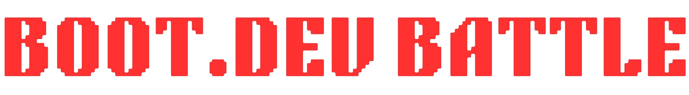
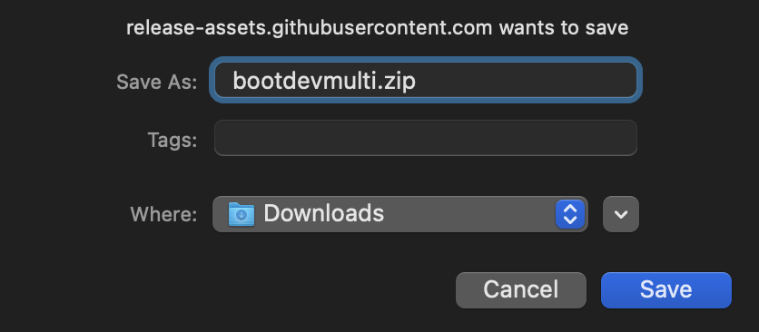
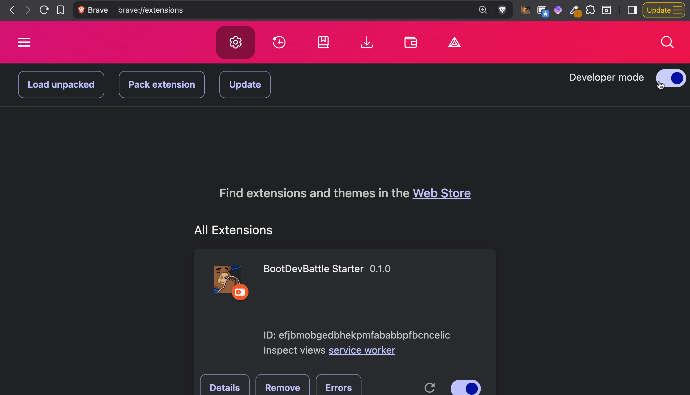
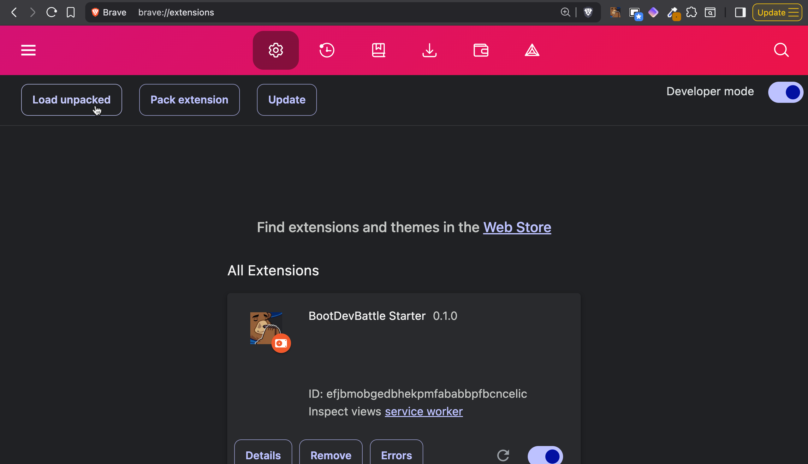
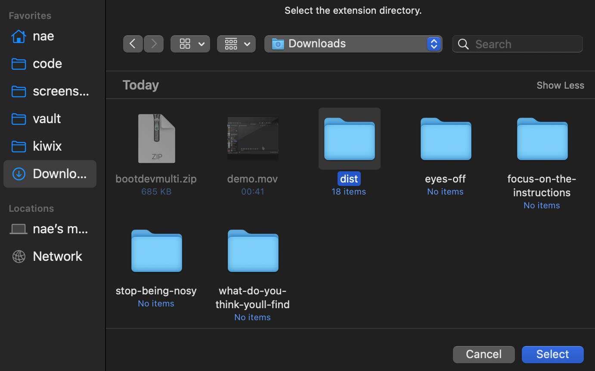
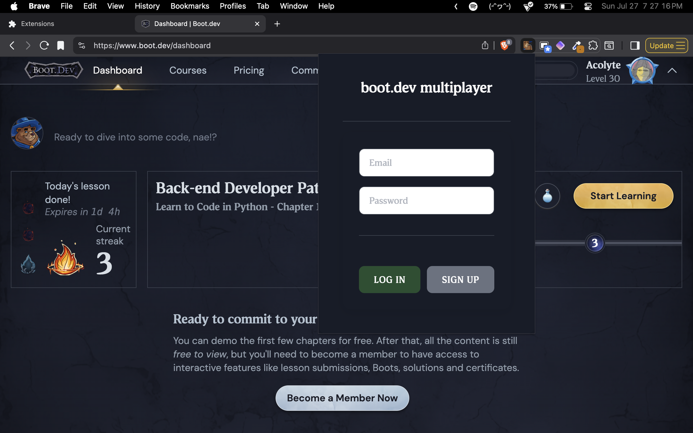

the chrome extension that flips your boot.dev session into a live‑fire multiplayer BRAWL

##THIS PROJECT IS NO LONGER MAINTAINED.

## description
create a room, send the 6 letter code to your competition, shit on your rivals in chat, then start coding!

a collapsible leaderboard tracks your rooms progress in real time.

no more lonely grind sessions. 

*who's ready to battle?*

## demo
https://youtu.be/qJMlNq1AX4M

## get started
1. **install the extension**

    download the zip from [releases](https://github.com/Eqedos/BootDevMulti/releases)

2. **in your chrome browser, head to `chrome://extensions`**

    *bdb also works with your favorite chromium browsers*

3. **enable developer mode**

4. **click load unpacked**

5. **select the dist folder from the unzipped package**

6. **head to [boot.dev](https://boot.dev) and start the battle!**

---
### **note:** a hard refresh (`ctrl-r` or `cmd-r`) will fix 99% of issues encountered.

demo accounts

**emails:**
- example@example.com
- exampleone@example.com  
- exampletwo@example.com
- examplethree@example.com

**password:**
12345

please don't abuse these 😊

---

created by [parth](https://github.com/Eqedos) and [nae](https://github.com/naestech) during the [boot.dev hackathon](https://blog.boot.dev/news/hackathon-2025/)
