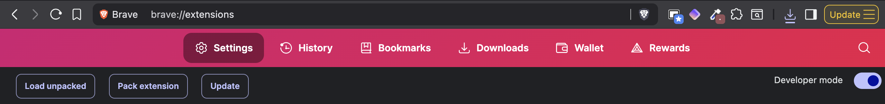
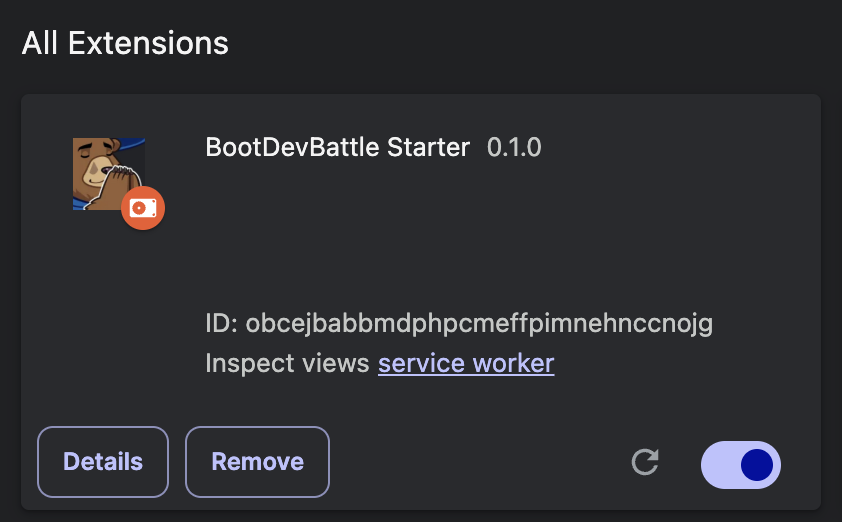

# bootdevbattle 
meet BDB. the chrome extension that flips your boot.dev session into a live‑fire multiplayer BRAWL.

create a room, send the 6 letter code to your competition, shit on your rivals in chat, then start coding! 

a collapsible leaderboard tracks your rooms progress in real time.

no more lonely grind sessions. 

*who's ready to battle?*

demo:  https://youtu.be/qJMlNq1AX4M

## get started
1. **install the extension**

    download the zip from [releases](https://github.com/Eqedos/BootDevMulti/releases)

2. **in your chrome browser, head to `chrome://extensions`**

    bdb works with chromium browsers

3. **enable developer mode**

4. **click load unpacked**

5. **select the dist folder from the unzipped package**

6. head to [boot.dev](https://boot.dev) and start the battle!

demo accounts

**emails:**
- example@example.com
- example2@example.com  
- example3@example.com
- example4@example.com

**password (copy to reveal):**
12345

please don't abuse these 😊

